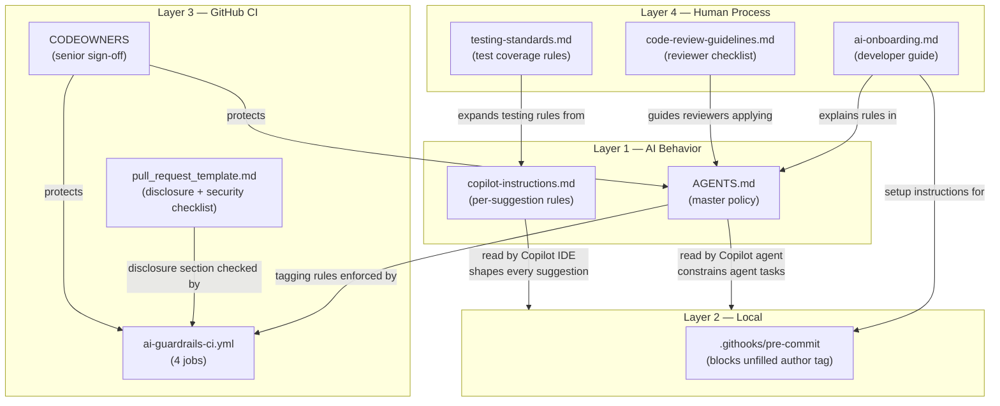

# AI Coding Guardrails — Overview

## Executive Summary

This repository establishes a structured set of controls to govern the use of
GitHub Copilot and other AI coding assistants across engineering teams. The
guardrails are designed to prevent junior developers from passively accepting
AI-generated code without understanding, reviewing, or testing it.

**Primary language: Java.** All rules, examples, and CI checks cover Java (Maven/Gradle)
alongside Python, Go, TypeScript, and JavaScript.

The controls operate in four layers:

1. **AI Behavior** — Instructions embedded in the repository that Copilot reads
   automatically, shaping what it generates before a developer sees a suggestion.

2. **Local Developer Machine** — Hooks and configuration that run on the
   developer's machine at commit time, catching issues before code leaves the
   workstation.

3. **GitHub (Remote Enforcement)** — Automated CI/CD checks and branch
   protection rules that block merges until all quality, security, and policy
   gates pass.

4. **Human Process** — Documentation that trains developers and reviewers to
   apply judgment that cannot be automated.

No single layer is sufficient on its own. The system is designed so that
bypassing one layer (e.g., ignoring a local warning) still results in
enforcement at a later layer (e.g., CI blocks the PR on GitHub).

**Core principle:** AI writes a draft. The developer owns the result.

---

## Guardrail Control Map

### Layer 1 — AI Behavior (What Copilot Is Told To Do)

| File | Applies | Read by | What it controls |
|---|---|---|---|
| [AGENTS.md](../AGENTS.md) | Repo-wide | Copilot agent mode, Claude Code, any AI agent | Master policy: what AI may/may not generate, prohibited patterns, tagging requirement, escalation process |
| [.github/copilot-instructions.md](../.github/copilot-instructions.md) | IDE (every suggestion) | GitHub Copilot in VS Code / JetBrains | Inline rules: tagging format, security rules, testing rules — applied to every autocomplete |

**Key difference:** `AGENTS.md` governs multi-step agent tasks.
`copilot-instructions.md` governs every single line suggestion in the editor.

---

### Layer 2 — Local Developer Machine

| File | Applies | Triggered by | What it controls |
|---|---|---|---|
| [.githooks/pre-commit](../.githooks/pre-commit) | Local only | `git commit` | Warns if `reviewed by: <author>` placeholder is unfilled in staged files |
| [pyproject.toml](../pyproject.toml) | Local + CI (Python) | `pytest` | Enforces 80% minimum test coverage — fails the test run if not met |
| [pom.xml](../pom.xml) *(Java/Maven)* | Local + CI (Java) | `mvn verify` | JaCoCo plugin enforces 80% line coverage; pins all dependency versions |
| `build.gradle` / `build.gradle.kts` *(Java/Gradle)* | Local + CI (Java) | `./gradlew test` | JaCoCo coverage verification task; dependency version management |

> **Activation required:** [.githooks/pre-commit](../.githooks/pre-commit) only works after running
> `git config core.hooksPath .githooks` once per developer machine.
> This is documented in [docs/ai-onboarding.md](ai-onboarding.md) under "One-Time Local Setup".

---

### Layer 3 — GitHub (Remote Enforcement)

| File | Applies | Triggered by | What it controls |
|---|---|---|---|
| [.github/workflows/ai-guardrails-ci.yml](../.github/workflows/ai-guardrails-ci.yml) | GitHub Actions | Every PR + push to `main` | Runs 4 automated jobs (see breakdown below) |
| [.github/pull_request_template.md](../.github/pull_request_template.md) | GitHub PR UI | Opening any PR | Forces AI disclosure checklist + security checklist to appear in every PR description |
| [.github/CODEOWNERS](../.github/CODEOWNERS) | GitHub merge rules | Every PR | Requires specific team members to approve changes to `AGENTS.md`, workflows, and `CODEOWNERS` itself |
| **Branch protection ruleset** (GitHub Settings) | GitHub merge button | Every merge attempt | Blocks direct pushes to `main`; requires all CI jobs to pass before merge is allowed |

#### CI Workflow Jobs Breakdown ([.github/workflows/ai-guardrails-ci.yml](../.github/workflows/ai-guardrails-ci.yml))

| Job name | Blocks merge | What it checks |
|---|---|---|
| `Secret Scanning` | Yes | Gitleaks + detect-secrets scan entire diff for credentials, tokens, API keys |
| `Tests & Coverage Gate` | Yes | Runs pytest / mvn / gradle / jest / go test with JaCoCo/pytest-cov; fails if coverage drops below 80% |
| `PR Policy Compliance` | Yes | Verifies AI disclosure section present, security checklist fully checked, AI tagging present when substantial AI usage is declared |
| `Protected File Guard` | Yes | Blocks any PR that modifies `AGENTS.md`, `.github/workflows/`, or `CODEOWNERS` without escalation |

---

### Layer 4 — Human Process (Not Automated)

| File | Applies | Who uses it | What it guides |
|---|---|---|---|
| [docs/code-review-guidelines.md](code-review-guidelines.md) | Code review | PR reviewers | How to spot AI-specific bugs, what requires senior sign-off, how to evaluate test quality |
| [docs/testing-standards.md](testing-standards.md) | Development | Developers writing tests | Mandatory test categories, naming conventions, mutation testing guidance, QA sign-off matrix |
| [docs/ai-onboarding.md](ai-onboarding.md) | Onboarding | New developers | Three-pass review rule, safe vs. unsafe Copilot usage patterns, practical exercises |

---

## What Is Automatic vs. What Requires Setup

| Control | Automatic? | What is needed |
|---|---|---|
| `AGENTS.md` read by Copilot agent | Yes | File must exist in repo root |
| `copilot-instructions.md` read by Copilot | Yes | File must exist in `.github/` |
| PR template loads on new PR | Yes | File must exist in `.github/` |
| CI workflow triggers on PR | Yes | File must exist in `.github/workflows/` |
| Branch protection blocks direct push | Requires one-time setup | Settings → Branches → Add ruleset in GitHub |
| CI checks block merge | Requires one-time setup | Must be added as required status checks in branch ruleset |
| CODEOWNERS enforced | Requires one-time setup | "Require review from Code Owners" must be enabled in branch ruleset |
| Pre-commit hook runs locally | Requires per-developer setup | Each developer runs `git config core.hooksPath .githooks` once |
| Human code review follows guidelines | Never automatic | Team culture + onboarding |

---

## Flow: From Code Generation to Merge

```
Developer writes code in IDE
        │
        ▼
.github/copilot-instructions.md  ← Copilot reads → shapes every suggestion
AGENTS.md                        ← Copilot agent reads → constrains agent tasks
        │
        ▼
Developer runs: git commit
        │
        ▼
.githooks/pre-commit             ← LOCAL: warns on unfilled <author> tags
        │
        ▼
Developer runs: git push → feature branch (direct push to main is blocked)
        │
        ▼
Developer opens Pull Request
        │
        ├── pull_request_template.md  ← AI disclosure + security checklist loads
        │
        ▼
GitHub Actions CI runs automatically
        │
        ├── Secret Scanning          ─┐
        ├── Tests & Coverage Gate     ├── All must pass — merge is BLOCKED if any fail
        ├── PR Policy Compliance      │
        └── Protected File Guard     ─┘
        │
        ▼
Human Code Review
        │
        ├── code-review-guidelines.md  ← Reviewer follows this checklist
        └── CODEOWNERS                 ← Senior sign-off enforced by GitHub
        │
        ▼
Merge to main ✅
```

---

## File Relationship Diagram



---

## What Cannot Be Automated

These controls rely entirely on human judgment and team culture:

| Rule | Why it cannot be automated |
|---|---|
| "Developer must understand every line" | No tool can verify comprehension |
| Senior sign-off for auth/crypto changes | Requires human judgment on what constitutes a security-sensitive change |
| All AI-generated lines are tagged | CI can only verify that *some* tags exist, not that *every* AI line is tagged |
| Code review quality | Tools can check coverage thresholds; only a human can assess whether tests are meaningful |
| Copilot compliance with `AGENTS.md` | Copilot reads the file and tries to follow it, but it is guidance — not a hard filter |

---

## File Reference Index

| File | Layer | Location |
|---|---|---|
| [AGENTS.md](../AGENTS.md) | AI Behavior | Repo root |
| [.github/copilot-instructions.md](../.github/copilot-instructions.md) | AI Behavior | `.github/` |
| [.githooks/pre-commit](../.githooks/pre-commit) | Local | `.githooks/` — activate with `git config core.hooksPath .githooks` |
| [pyproject.toml](../pyproject.toml) | Local + CI (Python) | Repo root |
| [pom.xml](../pom.xml) *(Java/Maven)* | Local + CI (Java) | Repo root |
| `build.gradle` / `build.gradle.kts` *(Java/Gradle)* | Local + CI (Java) | Repo root |
| [.github/workflows/ai-guardrails-ci.yml](../.github/workflows/ai-guardrails-ci.yml) | GitHub CI | `.github/workflows/` |
| [.github/pull_request_template.md](../.github/pull_request_template.md) | GitHub PR | `.github/` |
| [.github/CODEOWNERS](../.github/CODEOWNERS) | GitHub merge | `.github/` |
| [docs/code-review-guidelines.md](code-review-guidelines.md) | Human process | `docs/` |
| [docs/testing-standards.md](testing-standards.md) | Human process | `docs/` |
| [docs/ai-onboarding.md](ai-onboarding.md) | Human process | `docs/` |

---

*Last updated: 2026-03-04 | Maintained by: Platform Engineering*
